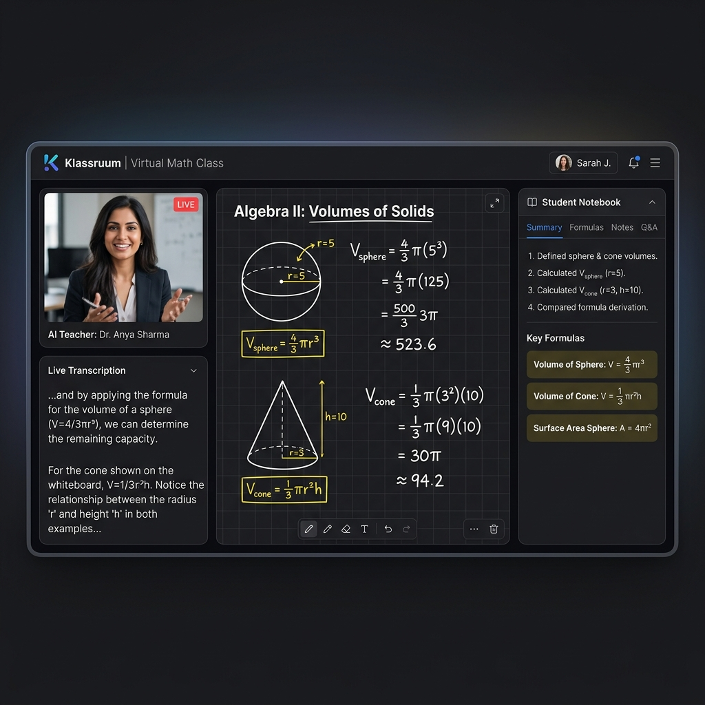
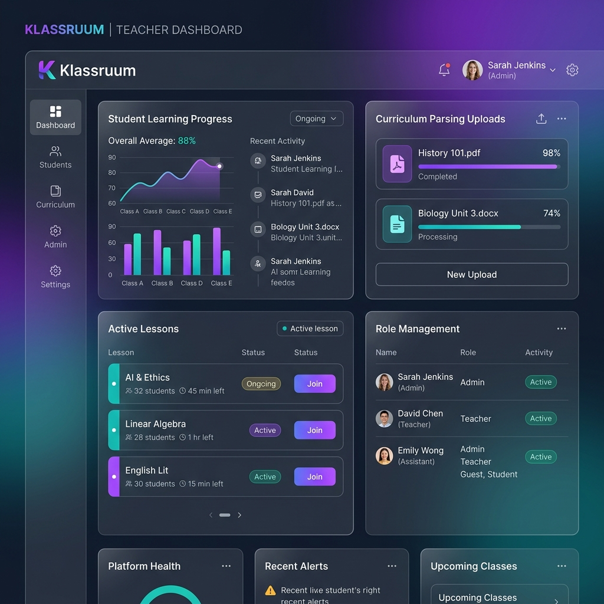
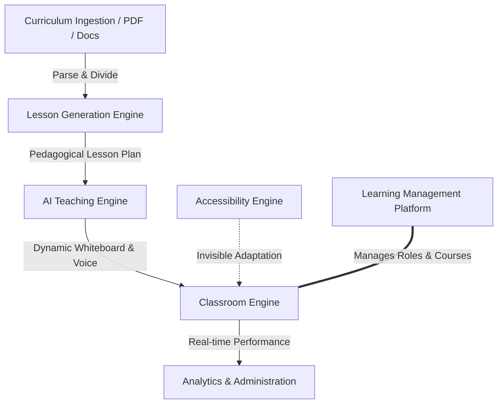

# 🎓 Klassruum

### AI-Powered Virtual Classrooms That Teach Like Real Teachers

[](https://github.com/mrwaacc-droid/exact-pixel-perfect-259-main)
[](#)
[](#)
[](#)

---

**Klassruum** is an AI-powered teaching platform that transforms static educational content into fully interactive virtual classrooms. Here, intelligent AI teachers deliver structured lessons, adapt dynamically to learner needs, answer contextual questions, assess understanding, and provide an engaging, accessible learning experience.

Unlike traditional Learning Management Systems (LMS) or standalone AI chatbots, Klassruum orchestrates an entire classroom environment—from curriculum ingestion and lesson generation to whiteboard writing, voice delivery, learner interactions, assessments, analytics, and accessibility.

---

## 🎨 Visual Previews

### 🖥️ Virtual Classroom Preview


### 📊 Dashboard & Analytics Preview


---

## 🎯 Vision

Our mission is to make high-quality education accessible to every learner worldwide by creating AI teachers that teach with the clarity, patience, structure, and adaptability of exceptional human educators.

---

## 🏛️ Platform Overview

Klassruum is composed of five interconnected, high-performance systems:



1. **AI Teaching Engine**: Delivers structured lessons with synchronized voice narration, letter-by-letter whiteboard writing, and adaptive, conversational explanations.
2. **Learning Management Platform**: Handles administrative tasks for institutions, teachers, learners, courses, enrollments, and progress tracking.
3. **Lesson Generation Engine**: Automates the ingestion of curriculum resources (PDFs, PPTs, text documents) and compiles them into structured lessons, quizzes, assignments, and teaching plans.
4. **Accessibility Engine**: Provides ambient, specialized user interfaces tailored for learners with varied needs, guaranteeing an inclusive experience.
5. **Analytics & Administration Platform**: Exposes real-time dashboards and reports for platform administrators, institutions, teachers, parents, and learners.

---

## ✨ Key Features

### 👨‍🏫 AI Teacher
* **Natural Conversational Teaching**: Delivers curriculum using human-like verbal styles, shifting paces and tones dynamically.
* **Context-Aware Question Answering**: Learner questions are answered contextually within the active lesson frame rather than as a generic chatbot response.
* **Interactive Whiteboard Explanations**: Features handwriting-mimicking whiteboard animation with cursor paths to simulate a real teacher's live explanation.
* **Adaptive Teaching Strategies**: Simplifies complex topics, offers analogies, or changes explanation strategies based on student progress.
* **Automatic Misconception Detection**: Detects common mistakes or student hesitation and intervenes with corrective paths.

### 📚 Intelligent Lesson Generation
Allows institutions or teachers to:
* Set up educational programs and courses.
* Upload physical curriculum resources (PDFs, Word docs, PowerPoint slides, plain text files).
* Configure lesson duration and choose target teaching steps.

The engine compiles these inputs into:
* Extracted learning objectives and success criteria.
* Chronological lesson plans divided into logical steps.
* Teacher scripts, whiteboard drawing sequences, quizzes, exit tickets, and homework assignments.

### 🎨 Classroom Engine
Every virtual classroom workspace incorporates:
* **AI Teacher Visual Avatar**: Engaging avatar representing the virtual instructor.
* **Animated Interactive Whiteboard**: Letter-by-letter handwriting effect that auto-scrolls and supports step replays.
* **Voice Narration**: Synchronized spoken instruction with adaptive speeds.
* **Contextual Question Panel**: Allows learners to ask questions textually or vocally at any checkpoint.
* **Active Notes Panel**: Integrates learner-facing study notes and teacher-facing lesson delivery guides.
* **Assessments & Quizzes**: Injected mid-lesson checkpoints, exit tickets, homework blocks, and performance score breakdowns.

---

## ♿ Ambient Accessibility Modes

Accessibility is built directly into the UI layers, adjusting layouts and interaction models based on user needs:

| Mode | Target Audience | Visual & Layout Adjustments | Speech & Voice Tuning | Key Interactive Target Size |
| :--- | :--- | :--- | :--- | :--- |
| **Standard** | Typical Learners | Full feature set, coordinated teacher feed, canvas, notes. | Conversational speed (1.0x). | Standard targets (32px-40px). |
| **Deaf** | Hearing Impaired | High-contrast, persistent visual captions, popup warnings, highlighting. | Voice disabled / optional. | Standard targets. |
| **Blind** | Visually Impaired | Screen-reader compatible elements, large text descriptions. | Voice-first narration with automated voice listening triggers. | Keyboard shortcut driven. |
| **Speech Difficulty** | Vocal Challenges | Non-verbal chat options, alternative selection keys. | Voice narration active; speech input disabled. | Standard targets. |
| **ADHD Focus** | Neurodivergent | Stripped-down minimalist layout, visual elements limited to whiteboard only. | Slowed down, structured pacing with focus reminders. | Standard targets. |
| **Motor Support** | Mobility Impaired | Focus indicators, linear navigation orders. | Voice control enabled. | Expanded interaction targets (44px+). |

---

## 👥 User Roles & Dashboards

Klassruum features five distinct portals to manage educational environments:

| Role | Primary Responsibilities & Capabilities | Dashboard Views & Reports |
| :--- | :--- | :--- |
| **Platform Admin** | Platform configuration, subscription models, institution setups, usage analytics, system monitoring. | System health logs, revenue trackers, user directories. |
| **Institution** | Teacher & learner enrollment, curriculum uploads, course publishing, school analytics, billing. | School performance overview, syllabus completion metrics. |
| **Teacher** | Class setups, editing lesson scripts, previewing AI modules, homework review, checking student queries. | Real-time classroom logs, homework graders, diagnostic checklists. |
| **Learner** | Joining virtual lessons, taking notes, asking questions, completing checkpoints/exit tickets, monitoring growth. | Student progression maps, mastery charts, homework feedback. |
| **Parent** | Monitoring child progress, checking lesson attendance logs, checking assignments, receiving reports. | Attendance alerts, performance summaries, teacher review channels. |

---

## 🔄 The 16-Step Pedagogical Lesson Flow

To replicate the structure of premium school systems (such as the Kenyan CBC framework), every lesson follows a robust pedagogical sequence:

| Step | Phase | Pedagogical Purpose | Canvas / Board Action |
| :--- | :--- | :--- | :--- |
| **1. Welcome** | Introduction | Establish classroom context and greet the learner. | Title card, welcome notes, and teacher introduction script. |
| **2. Hook** | Engagement | Create interest with a practical scenario, real-world context, or puzzle. | Visual analogy, diagram, or dynamic hook question. |
| **3. Learning Objectives** | Goal Setting | Present clear goals and student success criteria. | Bullet list of goals written letter-by-letter. |
| **4. Activate Prior Knowledge** | Retrieval | Review background concepts or perform a prerequisite skills check. | Quick question check or brief review formula illustration. |
| **5. Explain Concept** | Direct Instruction | Break down the core idea slowly on the whiteboard. | Step-by-step definition writing and key terms highlights. |
| **6. Guided Example** | Modeling | Step-through a worked problem on the canvas with detailed steps. | Full calculation written stroke-by-stroke with explanations. |
| **7. Check Understanding** | Formative Assessment | Interject with a mid-lesson question to diagnose immediate retention. | Injects interactive checkpoint overlay. |
| **8. Clarify Misconceptions** | Remediation | Address common errors or alternate paths if the check failed. | "Common mistakes vs correct methods" comparative table on whiteboard. |
| **9. Second Example** | Deepening | Show a variation of the worked example to demonstrate transfer. | Altered calculation format to test adaptability. |
| **10. Practice Together** | Collaborative Practice | Solve a problem interactively, guiding the learner through choices. | Blanks in steps filled by student inputs. |
| **11. Independent Practice** | Student Work | Graded practice (beginner, intermediate, advanced) completed by the learner. | List of practice problems with interactive options. |
| **12. Question Session** | Dialogue | A 5-minute checkpoint for students to raise hands or ask custom questions. | Contextual question input overlay. |
| **13. Summary** | Consolidation | Highlight key takeaways, formulas, and common mistakes on the board. | Formatted study card with key formulas displayed on whiteboard. |
| **14. Exit Ticket** | Final Check | A mandatory final problem to evaluate performance before departure. | Required exit query panel before ending. |
| **15. Homework** | Extension | Assign structured follow-up tasks linked to their mastery level. | Structured homework assignments sheet visible. |
| **16. Reflection** | Metacognition | Prompt the student to score their confidence and list remaining concerns. | Learner confidence slider & feedback box. |

---

## 🛠️ Technology Stack

### Frontend
* **Core**: React 19, TypeScript
* **Routing**: [TanStack Router](https://tanstack.com/router) & [TanStack Start](https://tanstack.com/start)
* **Styling**: Tailwind CSS & [Vite](https://vite.dev) (Vite bundler setup)
* **Visuals & Graphs**: GSAP, Lucide Icons, Recharts, Three.js

### Backend
* **Database**: PostgreSQL (via Supabase)
* **Authentication**: Supabase Auth (multi-role logic)
* **Realtime**: Supabase Realtime (session lifecycle & presence tracking)
* **Storage**: Supabase Storage (for curriculum slides, PDFs, and assets)
* **Compute**: Supabase Edge Functions

### AI Engine
* **Language Models**: OpenAI API (GPT-5.5 in Codex), DeepSeek API
* **Speech Synthesis**: ElevenLabs, Kokoro, Piper (local & edge TTS servers)

---

## 🤖 How OpenAI Was Used

OpenAI models played two distinct and transparent roles in the creation and execution of Klassruum:

### 1. During Software Development
**GPT-5.5 (via Codex)** was used as an engineering assistant throughout the design and construction of the platform. Specifically, it helped with:
* Designing the complex database migrations and relational schemas in Supabase.
* Architecting the 13-type TypeScript safety layers ([lesson-types.ts](file:///e:/Codes/exact-pixel-perfect-259-main/src/lib/lesson-types.ts)) for structured teaching steps.
* Refining accessibility compliance with WCAG 2.1 standards.
* Auditing route generation and state flow inside TanStack Router.

### 2. Inside the Product
OpenAI models act as the core cognitive processor behind the virtual teacher during live lessons:
* Generating contextual answers based on active whiteboard states and lesson transcripts.
* Creating analogies and adaptive explanations on the fly if a student fails a checkpoint question.
* Compiling curriculum documents into interactive lesson steps, exit tickets, and master scripts.
* *Note:* All AI responses are tightly bound to the scope of the current lesson to prevent off-topic interactions.

---

## 📈 Platform Status

### ✅ Implemented
* **Authentication**: Multi-role onboarding paths for Admins, Institutions, Teachers, Students, and Parents.
* **Classroom Engine UI**: Features `AnimatedWhiteboard`, `QuestionSystem`, `LearnerNotesPanel`, `TeacherNotesPanel`, and `LessonCompletionFlow`.
* **Database Infrastructure**: 30 database migrations tracking payments, CBC curriculum, session booking, and student performance.
* **Billing System**: Paystack checkout integration for course purchases.
* **Ambient Accessibility**: 6 operational layout variations.
* **Realtime Synchronization**: Session presence and live tracking.

### ⏳ In Progress
* Automatic PDF & PowerPoint curriculum parsers.
* OCR pipeline for printed textbook extraction.
* Sign language visual avatar feedback.
* Advanced student cognitive load modeling.
* Offline mode capability & localized voice cloning.

---

## 🗺️ Roadmap

### Phase 2: Intelligent Teaching Engine
* Fully automated curriculum text-and-figure extraction.
* Real-time teacher co-pilot console for monitoring live student hurdles.
* Collaborative peer classrooms.

### Phase 3: Enterprise & Scale
* Public classroom API and white-label deployments.
* Interactive AI laboratory simulations.
* Advanced multilingual teaching pipelines and sign language avatar overlays.

---

## 🚀 Getting Started

### 📋 Prerequisites
* Node.js (v18+ recommended)
* Bun or NPM package manager
* Supabase CLI (optional, for local DB development)

### 💻 Installation
1. Clone the project and navigate to the directory:
   ```bash
   git clone <repository-url>
   cd exact-pixel-perfect-259-main
   ```
2. Install dependencies:
   ```bash
   npm install
   ```
3. Set up environment variables:
   Copy `.env.example` to `.env.local` and populate the values:
   ```bash
   cp .env.example .env.local
   ```
4. Run the development server:
   ```bash
   npm run dev
   ```
5. Open the app in your browser at `http://localhost:3000`.

---

## 🤝 Contributing

We welcome contributions from educators, developers, designers, accessibility specialists, and AI researchers. Please open an issue to discuss major changes before submitting a pull request.
